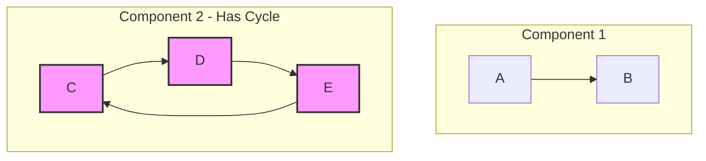
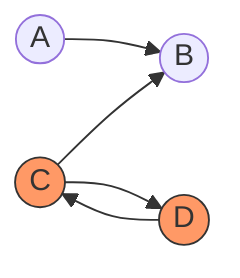
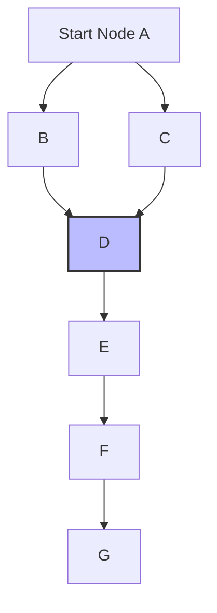
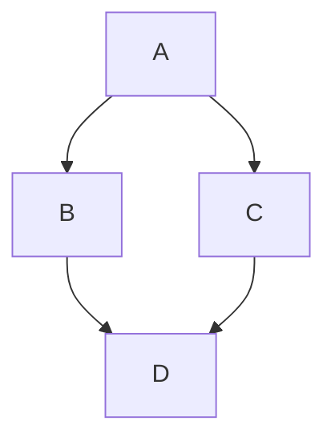

## 环检测

参考：[javascript-algorithms/detect-cycle](https://github.com/trekhleb/javascript-algorithms/tree/master/src/algorithms/graph/detect-cycle)

### 思路

保证所有节点的邻接节点都不会形成环

### FAQ

#### 1. 我只要找到起点，然后进行 dfs，一轮就可以知道有没有环

非连通图

没有办法找到一个起点，可以按照连线遍历完所有节点

#### 2. visited 有什么作用？

没有 `visited`，D 节点会被重复访问

#### 3. 为什么要删除 `recStack` 中的节点？

`D` 节点如果不删除，第二轮遍历时还会碰到，会误认为是环

第二轮 DFS 时（从节点 C 开始），如果 D 仍在 `recStack` 中，会误认为存在环。但实际上 D → C 的边并不存在，只是因为第一轮 DFS 时 D 被加入过 `recStack`。

因此，节点完成遍历后需要从 `recStack` 中移除，确保不同 DFS 路径之间互不影响。
