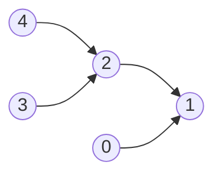

## 拓扑排序

* https://www.youtube.com/watch?v=ddTC4Zovtbc&list=PLLXdhg_r2hKA7DPDsunoDZ-Z769jWn4R8
* https://www.geeksforgeeks.org/dsa/topological-sorting-indegree-based-solution/

### 思路

dfs

bfs

1. 找到所有入度为 0 的节点，存储到队列中
2. 出队队列中的节点，放到排序结果中，并且减少它们所有邻接节点的入度（相当于移除已经处理过的节点）
3. 重复第一步，直到图中没有入度为 0 的节点 （队列为空）

### FAQ

**为什么 0 不需要在 2 前面？**

排序结果 `[4, 3, 2, 0, 1]` 正确

在拓扑排序中，只有边连接的俩个顶点才会有先后顺序。 0 和 2 之间并没有任何连线，没有先后顺序
